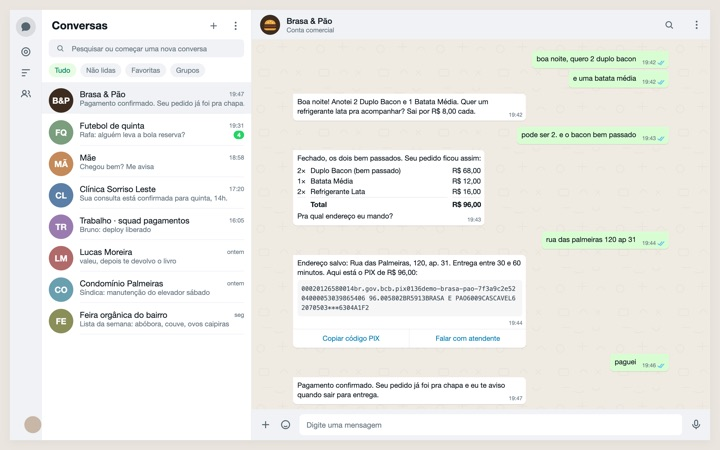

<a href="https://www.linkedin.com/in/viniciusf-candido"><picture>
  <source media="(prefers-color-scheme: dark)" srcset="assets/cabecalho-escuro.svg">
  
</picture></a>

Construo software há 13 anos e IA aplicada em produção desde 2021. Hoje sou engenheiro de IA sênior no Sicoob, onde lidero tecnicamente a frente de IA do assistente de investimentos. Antes, fui arquiteto sênior de IA na Contabilizei, liderei os projetos de chatbot Blip da Vertigo e trabalhei no Waizer, da Wiv.

**[Falar comigo no LinkedIn](https://www.linkedin.com/in/viniciusf-candido)** &nbsp;&nbsp; [Portfólio com os casos](https://vlfcandido.github.io)

## Onde construí IA e chatbots

| empresa | o que fiz | onde ler |
|---|---|---|
| Sicoob | Lidero tecnicamente a frente de IA do assistente de investimentos, com três agentes. | [MobileTime, 17/07/2026](https://www.mobiletime.com.br/noticias/17/07/2026/sicoob-ia-investimento/) |
| Contabilizei | Arquiteto sênior de IA; trabalhei no The Concierge, atendimento com IA generativa em Vertex AI. | [Google Cloud, 20/03/2025](https://blog.google/intl/pt-br/produtos/nas-nuvens/google-cloud-90-casos-de-ia-na-america-latina-que-estao-moldando-o-futuro-da-inovacao/) |
| Vertigo | Liderei os projetos de chatbot na Blip, de órgãos públicos a grandes empresas. | [case Prefeitura de Franca](https://materiais.vertigo.com.br/case-chatbot-prefeitura-de-franca-estado-de-sao-paulo) |
| Wiv | Trabalhei no Waizer, que analisa as conversas dos chatbots e aponta onde travam. | [MobileTime, 12/06/2026](https://www.mobiletime.com.br/noticias/12/06/2026/wiv-5-milhoes/) |

## Código aberto

<table>
<tr>
<td width="50%" valign="top">

<a href="https://github.com/vlfcandido/aprovaos"><b>aprovaos</b></a> Agente que conduz o estudo para concursos: diagnóstico, plano do dia, questões no padrão da banca e revisão espaçada. FastAPI e SQLAlchemy 2.0.

</td>
<td width="50%" valign="top">

<a href="https://github.com/vlfcandido/nexus-quant-showcase"><b>nexus-quant-showcase</b></a> Bot de trading em cripto, hoje em simulação: reconciliação com a corretora, Redis Streams e painel próprio. A vitrine conta o que deu errado, inclusive as taxas.

</td>
</tr>
<tr>
<td valign="top">

<a href="https://github.com/vlfcandido/bot-pedidos-whatsapp-llm"><b>bot-pedidos-whatsapp-llm</b></a> Pedidos por WhatsApp com roteador LLM, agentes com tools tipadas e transbordo para humano.

</td>
<td valign="top">

<a href="https://github.com/vlfcandido/revisor-ia"><b>revisor-ia</b></a> Revisor de código em que cada resposta da IA é medida: RAG com pgvector, MCP, Ragas e DeepEval.

</td>
</tr>
<tr>
<td valign="top">

<a href="https://github.com/vlfcandido/nexus-clips"><b>nexus-clips</b></a> Protótipo de agente que acompanha fontes, escolhe o tema e prepara cortes com legenda. LangGraph e React.

</td>
<td valign="top">

<a href="https://github.com/vlfcandido/engenharia-de-agentes"><b>engenharia-de-agentes</b></a> O mesmo agente em Pydantic puro, LangGraph e Google ADK, mais versões multiagente. Roda offline.

</td>
</tr>
<tr>
<td valign="top">

<a href="https://github.com/vlfcandido/varredura-voos"><b>varredura-voos</b></a> Busca de passagens que ordena pela duração total da viagem, não só pelo preço.

</td>
<td valign="top">

<a href="https://github.com/vlfcandido/benchmark-litellm-sdk-proxy"><b>benchmark-litellm-sdk-proxy</b></a> Latência, tempo até o primeiro token, erros e custo: LiteLLM SDK contra LiteLLM Proxy.

</td>
</tr>
</table>

Também: [previsao-tempo-chatbot](https://github.com/vlfcandido/previsao-tempo-chatbot) e [api-intervalo-premios-filmes](https://github.com/vlfcandido/api-intervalo-premios-filmes).

## Como trabalho

Preço fechado antes de começar, versão de teste em 24 a 48 horas, entrega com testes e o que foi feito por escrito, e 7 dias de correção sem custo. Com IA, o que conta é o que dá para medir: avaliação automática antes de trocar prompt ou modelo.

Python, FastAPI, Java, Node.js e TypeScript no back-end; LangGraph, Google ADK, Vertex AI, Gemini e Claude na IA; PostgreSQL, Redis e BigQuery nos dados; GCP, Docker e CI/CD na entrega.

Os prints usam dados fictícios.
